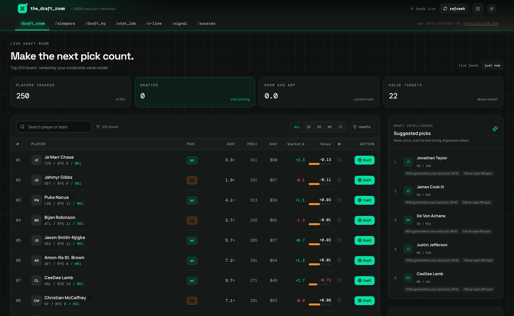
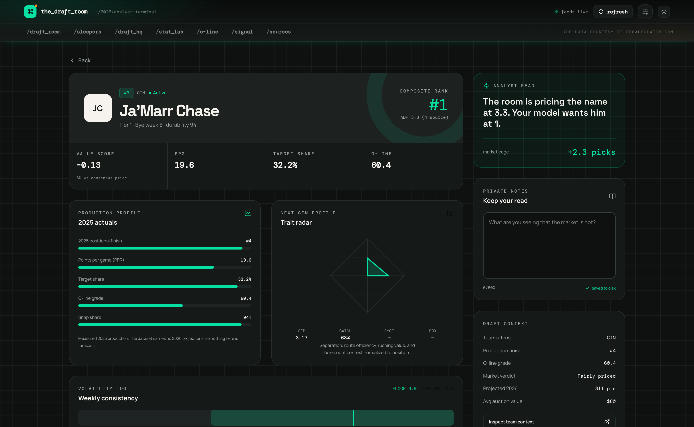
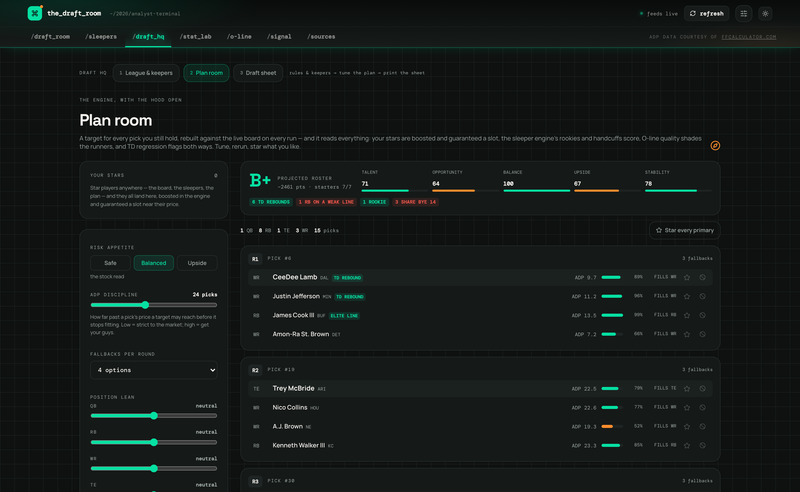
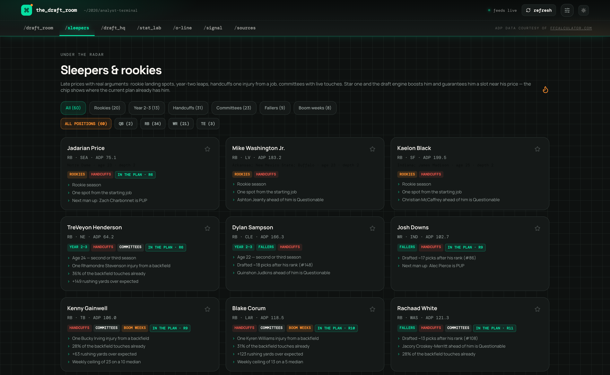
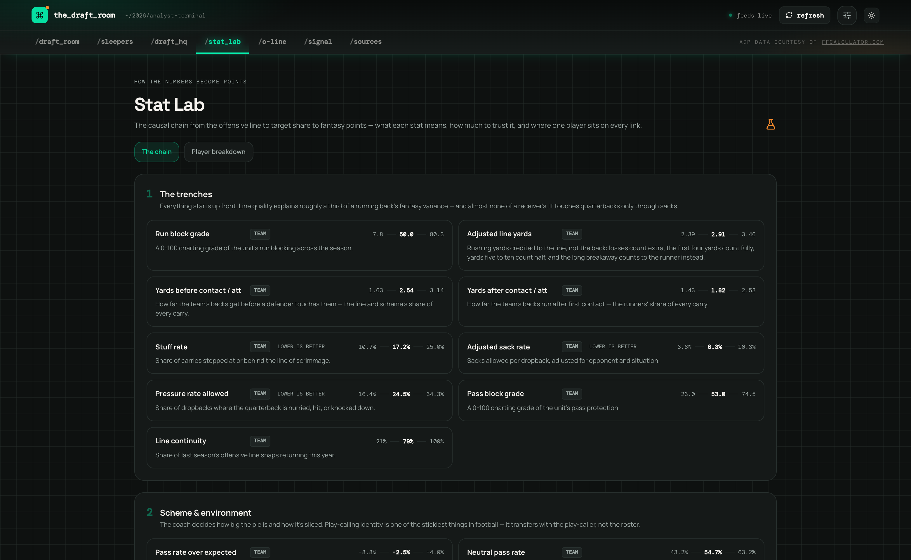
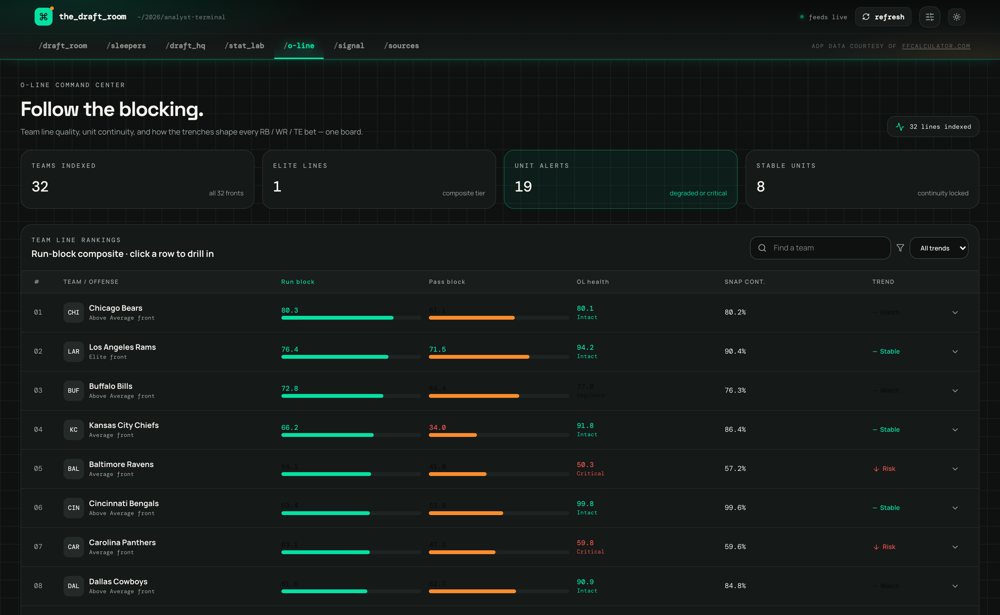
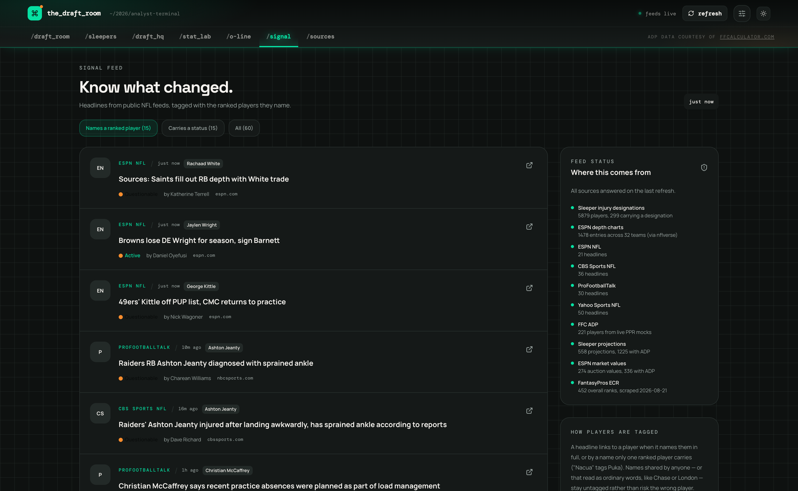

<div align="center">

# `the_draft_room`

**A local-first fantasy football analyst terminal for the 2026 season.**

Real 2025 production, consensus 2026 market prices, O-line context, and live
injury signal — fused into one draft board, with a plan engine that turns it
all into a round-by-round strategy for *your* league.

[](LICENSE)
[](https://nodejs.org)
[](https://pnpm.io)
[](https://www.typescriptlang.org)
[](https://react.dev)

[Quick start](#quick-start) ·
[Tour](#tour) ·
[Data sources](#data-sources) ·
[How the numbers work](#how-the-numbers-work) ·
[Architecture](#architecture) ·
[Development](#development)



</div>

## Why this exists

- **Local-first.** No accounts, no API keys, no telemetry. Everything runs on
  your machine, and the app never makes a network request except when you
  press **Refresh**.
- **Real data, honestly labeled.** The board is built on actual 2025
  production and observable 2026 market prices — not a black-box projection.
  Where a number *is* a forecast (Sleeper's projections), it says so; where
  data is missing, you see `—`, never a silent zero.
- **Your league's rules drive everything.** Teams, scoring, snake or auction,
  draft slot, roster spots, keepers — positional needs, pick math, and the
  entire draft plan derive from your settings.

## Quick start

Requires **Node.js 22+** and **pnpm 10** (`corepack enable pnpm` — the exact
version is pinned in `package.json`).

```bash
pnpm install && pnpm start
```

Open **http://localhost:8080**. That builds everything and serves the
dashboard and API as one process on one port. A 250-player dataset ships with
the repo, so the app is fully usable offline from a clean clone; press
**Refresh** in the top rail whenever you want live injuries, news, and market
prices.

## Tour

### The draft room

The top-250 board: sortable, filterable (position, bye, max ADP, health),
with one-click draft mode that tracks every team's picks as your draft runs.
The **Suggested Picks** rail argues each recommendation out loud — need,
price, tier scarcity, timing, injuries, byes — instead of handing you an
unexplained rank.

### Player deep dives

Every player opens a full dossier: 2025 production profile, Next Gen Stats
trait radar, weekly consistency (floor / ceiling / boom / bust), durability,
the market's verdict versus your model's — plus private notes that persist to
disk.



### Draft HQ — the plan engine

Three stations in sequence: set the league's rules and keepers, tune the plan
engine and rerun it against the live board, then print the sheet it produced.
The engine builds a target for every pick you still hold, with fallbacks per
round, a projected roster grade, and flags for TD regression, weak O-lines,
and stacked byes. Knobs exposed: risk appetite, ADP discipline, position
leans, QB/TE round gates. Starred players are boosted and guaranteed a slot
near their price; vetoed players vanish from the plan.



### Sleepers & rookies

Late prices with real arguments: handcuffs one injury from a starting job,
committee backs with live touches, year-two efficiency leaps, rookies with
draft capital, and fallers the room is letting slide. Every tag is explained,
and a chip shows where the current plan already slots the player.



### Stat Lab

Every number the platform tracks, laid out as the causal chain that ends in
fantasy points: the line blocks → the coach calls plays → the player earns
touches → converts them with some efficiency → scores → the market prices it.
Browse the chain as a field guide with live league ranges, or flip to the
player breakdown to see where one player sits on every link.



### O-line command center

All 32 fronts on one board — run-block and pass-block composites, unit health,
returning-snap continuity, and trend flags — because line quality explains
roughly a third of a running back's fantasy variance. Includes an RB ⇄ O-line
impact analysis for the backs whose price depends on their blocking.



### Signal feed

Headlines from public NFL feeds, tagged with the ranked players they name and
their current injury designation. The feed-status rail shows exactly what
every source returned on the last refresh — nothing is a mystery.



## Data sources

**The bundled dataset is real data, not projections.** The 250-player
snapshot in [`datasets/<date>/master.csv`](datasets/README.md) (~226 columns)
carries 2025 regular-season production, 2026 ADP/market data, and Next Gen /
consistency metrics. It contains **no 2026 projections** — nothing in it is a
forecast. It's produced by the Python pipeline archived in
`attached_assets/ff_analytics_scripts_*.zip`.

| Source | What it feeds | When |
|---|---|---|
| [nflverse](https://github.com/nflverse) | Play-by-play, weekly stats, Next Gen Stats, snap counts, rosters, PFR advanced | Bundled dataset |
| [DynastyProcess](https://github.com/dynastyprocess/data) | FantasyPros ECR mirror, player-ID crosswalk | Bundled dataset + refresh |
| [Sleeper](https://docs.sleeper.com/) | Injury designations · 2026 point projections with ADP | Refresh |
| [Fantasy Football Calculator](https://fantasyfootballcalculator.com) | Live mock-draft ADP | Refresh |
| ESPN | Crowd auction values with ADP · depth charts (via nflverse) | Refresh |
| ESPN / CBS / ProFootballTalk / Yahoo RSS | League news headlines | Refresh |

Live fetches happen **only** when you press Refresh — page loads never make
outbound requests — and everything fetched is cached under `data/cache/`.
ADP data courtesy of FantasyFootballCalculator.com. All data belongs to its
sources; this project is for personal, non-commercial use — respect each
source's terms of service.

## How the numbers work

- **Consensus prices.** ADP is averaged across every source that knows the
  player (the dataset's column included), with the per-source spread shown so
  you can see when the market disagrees with itself.
- **Value score.** Each player's 2025 production finish is compared against
  his consensus price, per position — positive means the market is
  underpricing what he actually did, negative means you're paying for hope.
  Players missing a finish or a price are left out, not zeroed.
- **The plan engine.** Simulates your draft pick by pick: positional needs
  from your roster rules, keeper rounds consumed, availability odds from
  consensus ADP, tier scarcity, O-line quality shading the runners, TD
  regression flagged both ways, and your stars and vetoes overriding it all.
- **Blank is not zero.** A blank cell means no 2025 sample (a rookie, a
  missed season); zero means he played and produced nothing. The app
  preserves the distinction everywhere.

## Architecture

```
lib/api-spec/openapi.yaml          ← single source of truth for the API
        │  (orval codegen)
        ├──► lib/api-zod            server-side request/response validation
        └──► lib/api-client-react   typed TanStack Query hooks for the SPA

artifacts/api-server               Express 5 API + draft/plan/sleeper/value
                                   engines (unit-tested), serves the built SPA
artifacts/fantasy-draft-dashboard  React 19 + Vite 7 + Tailwind 4 SPA
lib/dataset                        reads the player snapshot
lib/store                          CSV persistence (atomic writes, backups)
lib/live                           refresh pipeline: market, RSS, injuries
datasets/<date>/master.csv         the dataset shipped with the repo
attached_assets/                   the Python pipeline that produces it
```

One process serves everything in production: the API bundles with esbuild,
the SPA builds with Vite, and Express serves both from a single port. In dev
they run side by side with hot reload and an `/api` proxy.

Your draft board, notes, keepers, and league settings persist as plain
CSV/JSON under `data/` (gitignored), with one backup per session in
`data/user/backups/`.

## Development

```bash
pnpm dev        # API + Vite dev server with hot reload → http://localhost:5173
```

| Command | What it does |
|---|---|
| `pnpm start` | Build, then serve the whole app on one port |
| `pnpm run serve` | Serve an existing build |
| `pnpm dev` | Both dev servers, with hot reload |
| `pnpm run build` | Typecheck, then build API bundle + SPA |
| `pnpm run test` | Run all test suites |
| `pnpm run typecheck` | Typecheck every package |
| `pnpm --filter @workspace/api-spec run codegen` | Regenerate hooks + schemas from the OpenAPI spec |

To change the API, edit `lib/api-spec/openapi.yaml` and run codegen — the
server validation and the client hooks both regenerate from it, so the two
sides can't drift.

Environment variables all have local defaults: `PORT` (8080), `HOST`
(`127.0.0.1` — the server binds to loopback unless you say otherwise),
`DATA_DIR` (`./data`), `WEB_DIST` (the built dashboard), `API_URL` (the dev
proxy target).

The README screenshots regenerate with
[`docs/capture-screenshots.mjs`](docs/capture-screenshots.mjs) (headless
Chrome, no dependencies).

## Privacy & network behavior

- Binds `127.0.0.1` by default; set `HOST=0.0.0.0` only if you mean to
  expose it (e.g. from a container).
- Zero outbound requests on page load — only an explicit **Refresh**
  fetches, and responses are cached locally.
- All state lives in plain files under `data/` on your machine. Nothing
  leaves it.

## License

[MIT](LICENSE) © Rahil Bhatnagar
